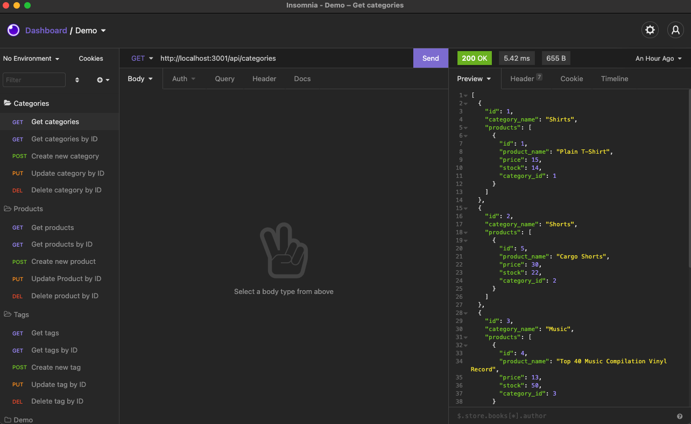

# E-Commerce Back End

This is the back-end built for an e-commerce site, configured with Express.js API to use Sequelize to interact with a MySQL database.

## Table of Contents

- [Description](#description)
- [Screenshot for Demo](#screenshot-for-demo)
- [Walkthrough Video](#walkthrough-video)
- [Questions](#questions)

## Description 
- Internet retail, also known as e-commerce, is the largest sector of the electronics industry, generating an estimated $29 trillion in 2019. E-commerce platforms like Shopify and WooCommerce provide a suite of services to businesses of all sizes. Due to their prevalence, understanding and know how to implement the fundamental architecture of these platforms is crucial as a full-stack web developer. 

## Screenshot for Demo
### Get request for Category 

## Walkthrough Video
- [Link for walkthrough video](https://drive.google.com/file/d/1AbLG8GwUaA-7GTKn6BwsU-A4IKP8VO6A/view?usp=sharing)

## Questions
- For more projects, please visit my [GitHub](https://github.com/elenaliu0415). 
- Please feel free to contact me at elenaliu0415@gmail.com